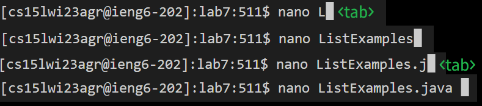
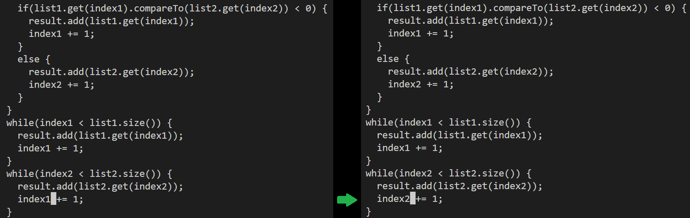

## Lab Report 4: Ruben A Gonzalez
---
**Step 4: Log into ieng6**
---
To sign in type the command *ssh <space> [username]* to log in to server.
>
Tip: An easier way to log in to server is to do <CTRL+R> and then <cse+tab>
```
$ ssh cs15lwi23agr@ieng6.ucsd.edu
(cs15lwi23agr@ieng6.ucsd.edu) Password:
Last login: Fri Feb 24 16:03:29 2023 from 181.214.70.138
```
---
**Step 5: Clone your fork of the repository from your Github account**
---
To clone the repository type the command *git clone <CTRL+v>* to paste the repository.
```
[cs15lwi23agr@ieng6-202]:~:509$ git clone git@github.com:rug005/lab7.git
Cloning into 'lab7'...
Warning: Permanently added the RSA host key for IP address '140.82.114.3' to the list of known hosts.
remote: Enumerating objects: 35, done.
remote: Total 35 (delta 0), reused 0 (delta 0), pack-reused 35
Receiving objects: 100% (35/35), 372.19 KiB | 1.39 MiB/s, done.
Resolving deltas: 100% (12/12), done.
```
---
We want to go into the directory lab7
---

---
**Step 6: Run the tests, demonstrating that they fail**
---


---

**Step 7: Edit the code file to fix the failing test**
---
For this example I used <CTRL+R> to search for my previous history.
>
Then type out javac -cp<ENTER>
 ```
 (reverse-i-search)`javac -cp': javac -cp .:lib/hamcrest-core-1.3.jar:lib/junit-4.13.2.jar *.java
 ```
 After pressing enter it'll compile it.
 ```
 javac -cp .:lib/hamcrest-core-1.3.jar:lib/junit-4.13.2.jar *.java
 ```
 ---
 We then <CTRL+P> *java -cp .:lib/hamcrest-core-1.3.jar:lib/junit-4.13.2.jar org.junit.runner.JUnitCore ListExamples.java*
 ---

---
Now we have to fix the error by using a command called nano.
>
---
For example:
 ---
 >

 ---
 >
 
 After this we want to press the keys down(x42) and right(x12). After this we will replace the 1 with a 2.
---

---
**Step 8: Run the tests, demonstrating that they now succeed**
```
[cs15lwi23agr@ieng6-202]:lab7:513$ javac -cp .:lib/hamcrest-core-1.3.jar:lib/junit-4.13.2.jar *.java
[cs15lwi23agr@ieng6-202]:lab7:513$ java -cp .:lib/hamcrest-core-1.3.jar:lib/junit-4.13.2.jar org.junit.runner.JUnitCore 
ListExamplesTests
JUnit version 4.13.2
..
Time: 0.014

OK (2 tests)

[cs15lwi23agr@ieng6-202]:lab7:514$
```
---
**Step 9: Commit and push the resulting change to your Github account (you can pick any commit message!)**
---
Using git add
```
[cs15lwi23agr@ieng6-202]:lab7:514$ git add ListExamples.java
```
Using git commit
```
[cs15lwi23agr@ieng6-202]:lab7:515$ git commit -m "update"
[main 20eddab] update
 Committer: Ruben A Gonzalez <cs15lwi23agr@ieng6-202.ucsd.edu>
Your name and email address were configured automatically based
on your username and hostname. Please check that they are accurate.
You can suppress this message by setting them explicitly. Run the
following command and follow the instructions in your editor to edit
your configuration file:

    git config --global --edit

After doing this, you may fix the identity used for this commit with:

    git commit --amend --reset-author

 1 file changed, 1 insertion(+), 1 deletion(-)
 ```
 Using git push
 ```
[cs15lwi23agr@ieng6-202]:lab7:516$ git push origin main 
Warning: Permanently added the RSA host key for IP address '140.82.114.4' to the list of known 
hosts.
Enumerating objects: 5, done.
Counting objects: 100% (5/5), done.
Delta compression using up to 8 threads
Compressing objects: 100% (2/2), done.
Writing objects: 100% (3/3), 354 bytes | 354.00 KiB/s, done.
Total 3 (delta 1), reused 1 (delta 1), pack-reused 0
remote: Resolving deltas: 100% (1/1), completed with 1 local object.
To github.com:rug005/lab7.git
   f750e52..20eddab  main -> main
[cs15lwi23agr@ieng6-202]:lab7:517$ 
```
---

