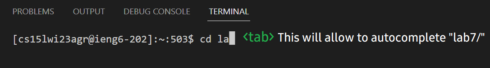
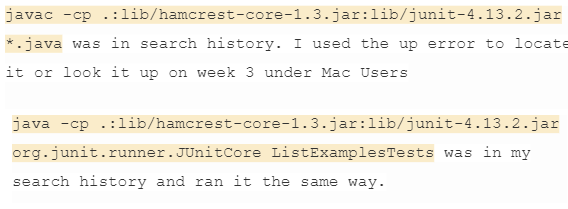
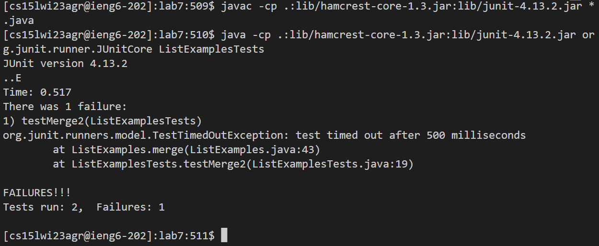

## Lab Report 4: Ruben A Gonzalez
---
**Step 4: Log into ieng6**
---
```
$ ssh cs15lwi23agr@ieng6.ucsd.edu
(cs15lwi23agr@ieng6.ucsd.edu) Password:
Last login: Fri Feb 24 16:03:29 2023 from 181.214.70.138
```
---
**Step 5: Clone your fork of the repository from your Github account**
---
```
[cs15lwi23agr@ieng6-202]:~:509$ git clone git@github.com:rug005/lab7.git
Cloning into 'lab7'...
Warning: Permanently added the RSA host key for IP address '140.82.114.3' to the list of known hosts.
remote: Enumerating objects: 35, done.
remote: Total 35 (delta 0), reused 0 (delta 0), pack-reused 35
Receiving objects: 100% (35/35), 372.19 KiB | 1.39 MiB/s, done.
Resolving deltas: 100% (12/12), done.
```
---
We want to go into the directory lab7
---

---
**Step 6: Run the tests, demonstrating that they fail**

---
**Step 7: Edit the code file to fix the failing test**
For this example I used ctrl-R to search for my previous history.

---
**Step 8: Run the tests, demonstrating that they now succeed**
---
**Step 9: Commit and push the resulting change to your Github account (you can pick any commit message!)**
---
